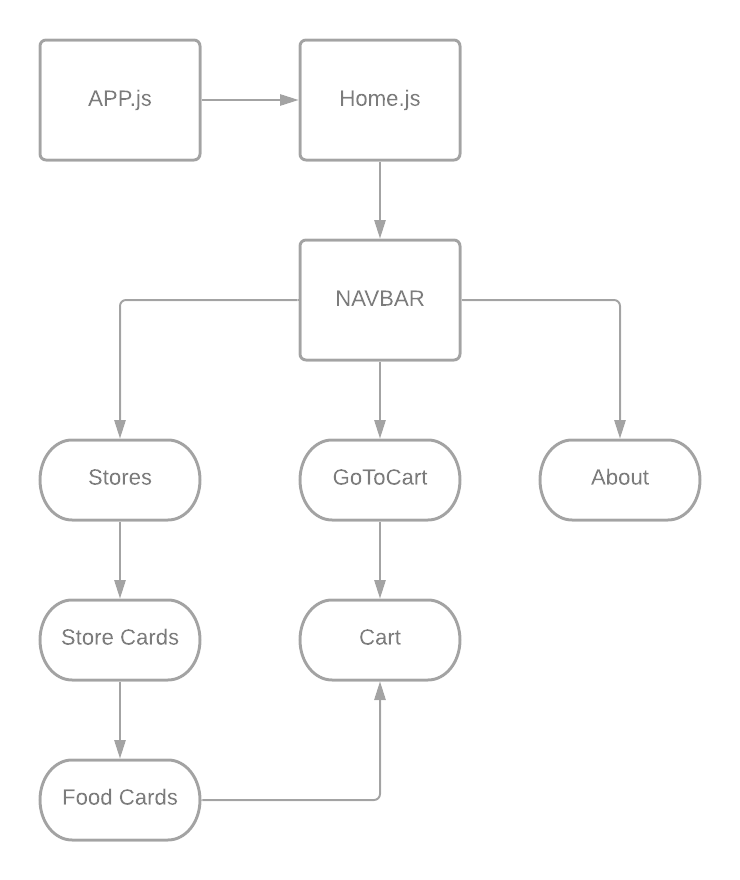
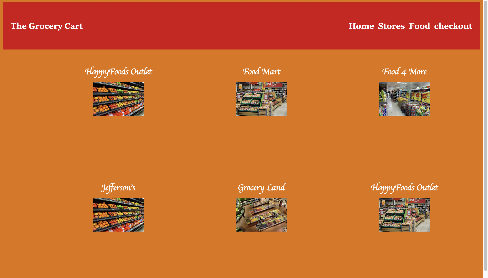
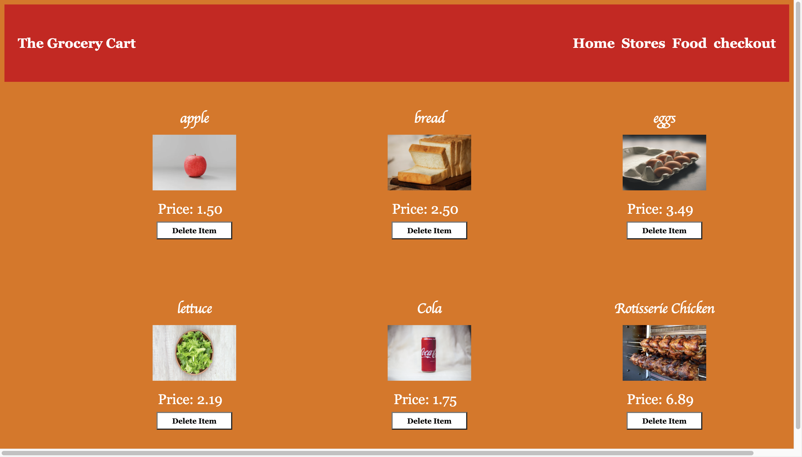

# The Grocery Cart

## Date: 08/27/2021

### By: Robert Thome

[DeployedSite](https://vast-tor-94949.herokuapp.com/)
[Trello](https://trello.com/b/NNP8cdXI/grocery-cart-app)
[GitHub](https://github.com/robertthome/Grocery-Cart)

***

### ***Description*** 

### Do all your shopping from the comfort of your own home. Select your favorite stores and start shopping away. 

### ***Technologies used***

* MongoDB
* Express
* React
* Express
* CSS

### ***Hierarchy Diagram***

 

 ### ***ERD***

 

 ## Website Screeshots

 
 
 

 ### ***Future Updates***

- [ ] Login Page
- [ ] Price total in checkout page
- [ ] Submit button for checkout